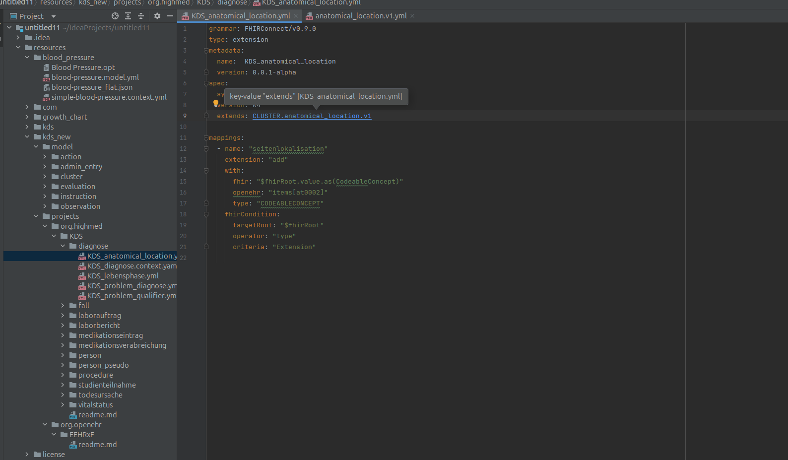
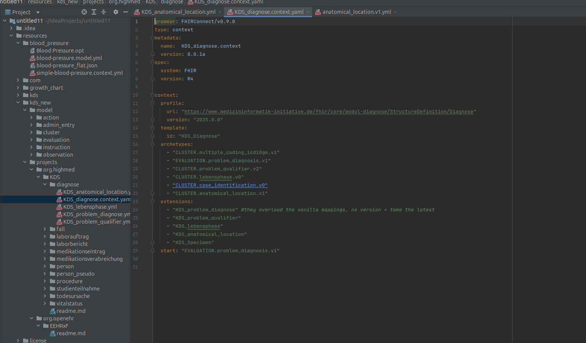
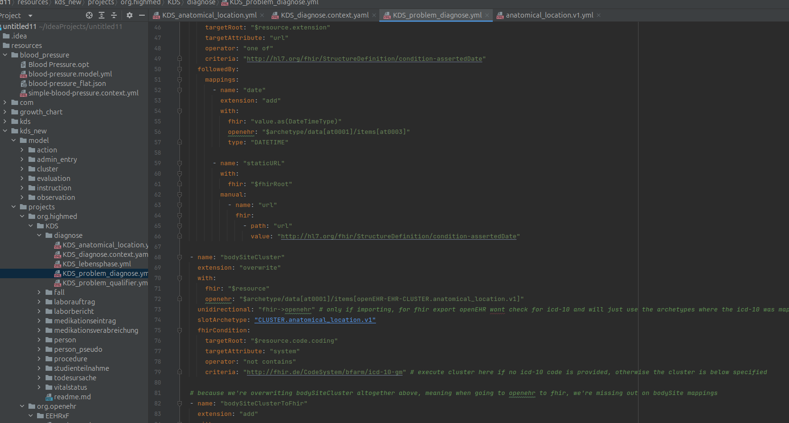

# FHIRConnect plugin for IntelliJ

[](https://github.com/openFHIR/intellij-fhir-connect/actions/workflows/build.yml)
[](https://plugins.jetbrains.com/plugin/26927-fhirconnect)

<!-- Plugin description -->
Navigation, completion, find usages and rename for [FHIRConnect](https://sevkohler.github.io/FHIRconnect-spec/)
mapping files, the open specification for bidirectional mappings between openEHR and FHIR.

- Ctrl+click / Ctrl+B from `slotArchetype`, `slotContext`, `spec.extends`, `context.archetypes`,
  `context.extensions`, `context.contexts` and `context.start` to the mapper that declares the name
- Ctrl+click or Alt+F7 on a mapper's `metadata.name` lists every file that uses it
- Ctrl+Space inside those keys completes the mapper names found in the project
- Shift+F6 on a `metadata.name` renames the mapper in every file that references it
<!-- Plugin description end -->

## Features

Jump from a context file to the model and extension mappers it references:



Jump from a `slotArchetype` to the model mapper:



See everywhere a mapper is used by clicking its `metadata.name`:



### Supported keys

| Reference site (file type) | Resolves to |
|---|---|
| `mappings[*].slotArchetype` (model / extension, also nested `followedBy.mappings` and `reference.mappings`) | model `metadata.name` (the `spec.openEhrConfig.archetype` id is accepted as well) |
| `spec.extends` (extension) | model `metadata.name` |
| `context.archetypes[*]` (context) | model `metadata.name` |
| `context.extensions[*]` (context) | extension `metadata.name` |
| `context.start` (context) | model `metadata.name` |
| `mappings[*].slotContext`, `context.contexts[*]` | context `metadata.name` |

A file is treated as a FHIRConnect file when its top-level `grammar` key starts with `FHIRConnect/`. Values
may be quoted or unquoted and files may use `.yml` or `.yaml`. When the same name is declared in several
places, the declaration closest to the referencing file wins; equally close candidates are offered in a
chooser.

## Installation

- **Marketplace:** Settings → Plugins → Marketplace, search for *FHIRConnect*, or install it from
  [plugins.jetbrains.com/plugin/26927-fhirconnect](https://plugins.jetbrains.com/plugin/26927-fhirconnect).
- **Manual:** download the zip from the [GitHub releases](https://github.com/openFHIR/intellij-fhir-connect/releases)
  and use Settings → Plugins → ⚙ → *Install Plugin from Disk…*.

## Compatibility

IntelliJ IDEA 2024.2 and newer (Community and Ultimate) and every other JetBrains IDE of the same platform
version that bundles the YAML plugin (PyCharm, WebStorm, GoLand, …). There is no upper version bound.

## Building from source

```shell
./gradlew build          # compile and test
./gradlew buildPlugin    # package build/distributions/FHIRConnect-<version>.zip
./gradlew runIde         # start a sandbox IDE with the plugin
./gradlew verifyPlugin   # JetBrains Plugin Verifier against the recommended IDE releases
./gradlew test           # tests only
```

JDK 21 is required (Gradle downloads one if needed). See [CONTRIBUTING.md](CONTRIBUTING.md) for the code
layout, the test data and the index version rule.

## Releasing

Set `pluginVersion` in `gradle.properties`, move the changelog entries under that version, then push a tag
`vX.Y.Z`. The release workflow signs and publishes the plugin and creates a GitHub release. It needs the
repository secrets `CERTIFICATE_CHAIN`, `PRIVATE_KEY`, `PRIVATE_KEY_PASSWORD` and `PUBLISH_TOKEN`.

## Roadmap

- AQL path autocompletion
- FHIRPath autocompletion
- Flat-path to AQL automatic conversion

## Related projects

- [FHIRconnect specification](https://github.com/SevKohler/FHIRconnect-spec)
- [openFHIR engine](https://github.com/medblocks/openFHIR)
- [FHIRconnect mapping library](https://github.com/SevKohler/FHIRconnect-mapping-lib)

## License

[Apache License 2.0](LICENSE)

-----

[](https://open-fhir.com)
